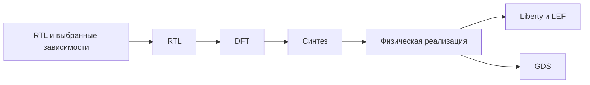

# Маршрут из Python-функций

Flow описывает граф, а CoreRef связывает выходы со входами стадий.


```mermaid
flowchart LR
    sources["RTL и выбранные зависимости"] --> RTL["RTL"]
    RTL --> DFT["DFT"]
    DFT --> synth["Синтез"]
    synth --> layout["Физическая реализация"]
    layout --> views["Liberty и LEF"]
    layout --> gds["GDS"]
```

Flow может прочитать `stage-map.yml` через `StageMap.load()` и выбрать
модули и варианты маршрута. Карта задаёт имена Python-функций, входы и выходы.
Небольшой маршрут можно объявить напрямую в Python.

```python
from functools import cached_property

from coreref.api.build import Route, Stage, StageSpec
from coreref.api.projects import Project


def bundle(work, log, configuration):
    (work / "rtl.v").write_text((work / "source.sv").read_text())


class RtlProject(Project):
    @cached_property
    def route(self):
        return Route([StageSpec(name="rtl", outputs=("rtl.v",))])

    @cached_property
    def stages(self):
        return {"rtl": Stage(transform=bundle, files={"source.sv": self.source / "rtl/top.sv"})}
```

Поместите функцию в импортируемый модуль. `project.build("rtl")["rtl.v"]`
возвращает путь к файлу в Nix store. Изменение объявленного входного RTL
создаёт новую derivation.

Релиз собирается из чистого Git checkout с существующим `manifest.lock`.
`project.publish()` последовательно копирует результаты и индекс в настроенный
Nix binary cache. Индекс можно зарегистрировать в каталоге потребителя.

```python
from coreref.api.packages import Catalog

index = project.publish()
consumer = Catalog(cache=cache, releases={project.ref: index})
files = consumer.get_outputs(consumer.info(project.ref), ("rtl.v",))
```
